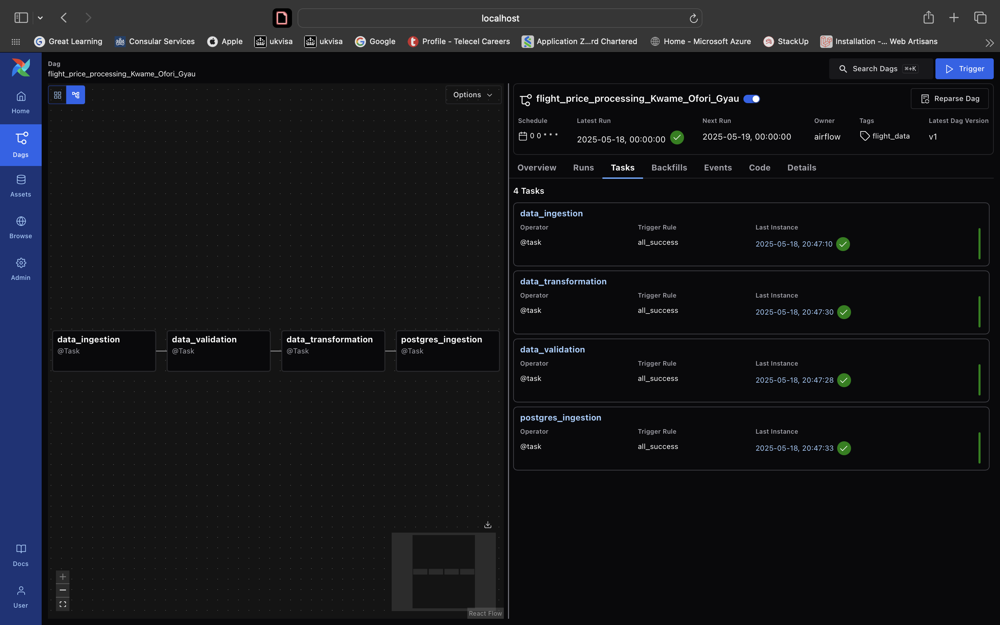

# Flight Price Processing Pipeline

## Overview
This pipeline processes flight price data from Bangladesh, performing data ingestion, validation, transformation, and storage. The pipeline extracts data from a CSV file, loads it into a MySQL staging database, transforms and analyzes the data, and finally transfers the results to a PostgreSQL database for reporting and analysis.

## Pipeline Architecture and Execution Flow

```
CSV File → MySQL Staging → Data Validation → Data Transformation → PostgreSQL Database
```



### Flow Details:
1. **Data Ingestion**: Raw flight data is extracted from a CSV file and loaded into a MySQL staging table
2. **Data Validation**: The data is checked for completeness, correctness, and consistency
3. **Data Transformation**: Analytical views are created including average fares, seasonal analysis, and route popularity
4. **Postgres Injection**: Transformed daata is loaded into PostgreSQL.

## Airflow DAG and Task Descriptions

### DAG: `flight_price_processing_Kwame_Ofori_Gyau`
- **Schedule**: Daily
- **Start Date**: May 17th, 2025
- **Catchup**: Disabled
- **Max Consecutive Failed Runs**: 3

### Tasks:

#### 1. `data_ingestion`
This task reads flight price data from a CSV file and loads it into the MySQL staging table.

**Functionality**:
- Reads data from `/usr/local/airflow/include/Flight_Price_Dataset_of_Bangladesh.csv`
- Inserts each row into the `stagingflightprices` table in MySQL
- Logs the number of rows processed

#### 2. `data_validation`
This task performs validation checks on the ingested data to ensure data quality and consistency.

**Functionality**:
- Validates column existence and completeness
- Checks data types for all fields:
  - String fields (Airline, Source, Destination, etc.)
  - Datetime fields (Departure_Date_Time, Arrival_Date_Time)
  - Numeric fields (Duration_hrs, Base_Fare_BDT, etc.)
- Identifies and logs:
  - Missing values
  - Type inconsistencies
  - Data anomalies (e.g., negative fares)

#### 3. `data_transformation`
This task performs analytical transformations on the flight data and creates derived tables.

**Functionality**:
- **Airline Analysis**: Calculates average fares by airline (base, tax, and total)
- **Seasonal Analysis**: Analyzes fare variations by season
- **Booking Analysis**: Counts bookings by airline
- **Route Analysis**: Identifies the most popular routes and their average fares

**Output Tables**:
- `avg_fares_by_airline`: Average fares for each airline
- `seasonal_fare_analysis`: Fare variations by season
- `airline_booking_counts`: Number of bookings by airline
- `popular_routes`: Top 10 most frequent routes with source/destination details

#### 4. `postgres_ingestion`
This task transfers the transformed data from MySQL to PostgreSQL for reporting.

**Functionality**:
- Creates the necessary tables in PostgreSQL if they don't exist
- Truncates existing data to ensure fresh data is loaded
- Transfers data from the following MySQL tables to PostgreSQL:
  - `avg_fares_by_airline`
  - `seasonal_fare_analysis`
  - `airline_booking_counts`
  - `popular_routes`
- Creates a comprehensive `complete_flight_data` table containing all flight details for advanced analysis

## KPI Definitions and Computation Logic

### 1. Average Fare by Airline
**Definition**: The average base fare, tax surcharge, and total fare for each airline.

**Computation**:
```python
avg_fares_by_airline = df.groupby('Airline')[['Base_Fare_BDT', 'Tax_Surcharge_BDT', 'Total_Fare_BDT']].mean()
```

### 2. Seasonal Fare Analysis
**Definition**: Average fares and booking counts across different seasons.

**Computation**:
```python
seasonal_avg_fares = df.groupby('Seasonality')[['Total_Fare_BDT']].agg(['mean', 'count'])
```

### 3. Airline Popularity Metrics
**Definition**: The number of bookings per airline as a measure of popularity.

**Computation**:
```python
booking_counts = df['Airline'].value_counts().reset_index()
```

### 4. Route Popularity Analysis
**Definition**: The most frequently flown routes with their source, destination, frequency, and average fare.

**Computation**:
```python
df['Route'] = df['Source'] + '-' + df['Destination']
popular_routes = df['Route'].value_counts().reset_index()
```

### 5. Route Pricing Analysis
**Definition**: Average fare for each popular route.

**Computation**:
```python
avg_fare = df[(df['Source'] == source) & (df['Destination'] == destination)]['Total_Fare_BDT'].mean()
```

## Environment Configuration

The pipeline requires the following environment variables:

### MySQL Configuration
- `MYSQL_HOST`: MySQL host address (default: 'mysql_db2')
- `MYSQL_USER`: MySQL username (default: 'flightuser')
- `MYSQL_PASSWORD`: MySQL password (default: 'myuserpass')
- `MYSQL_DATABASE`: MySQL database name (default: 'flightdb')

### PostgreSQL Configuration
- `POSTGRES_HOST`: PostgreSQL host address (default: 'postgres')
- `POSTGRES_USER`: PostgreSQL username (default: 'postgres')
- `POSTGRES_PASSWORD`: PostgreSQL password (default: 'postgres')
- `POSTGRES_DATABASE`: PostgreSQL database name (default: 'postgres')
- `POSTGRES_PORT`: PostgreSQL port (default: '5432')

## Logging

The pipeline logs activities to `/usr/local/airflow/plugins/log_file.log` with the following information:
- Timestamp
- Log level
- Message details

## Error Handling

The pipeline includes error handling and logging at each stage:
- Failed database connections
- Data validation issues
- Transformation errors
- PostgreSQL ingestion failures


## Challenges faced 
- The astonomer came with its own containers except mysql. Where i used the bitnami image for mysql. The connection between python and the databse failed. so i switched to mysql 8.0 image where it worked.

- Also i had to find out the network astronomer uses and then forcefully place the mysql container on that network. so i check the network with docker network ls , docker network inspect <network_name>. After i find out which network the containers are on i added the network name to the docker override file.

- schedule works with astronomer instead of schedule_interval.

- mysql was not accepting some of the column names that had spacing and some symbols like '&' even though i used the bak ticks. I had to resort to using undescore and removing such spaces.

- 
