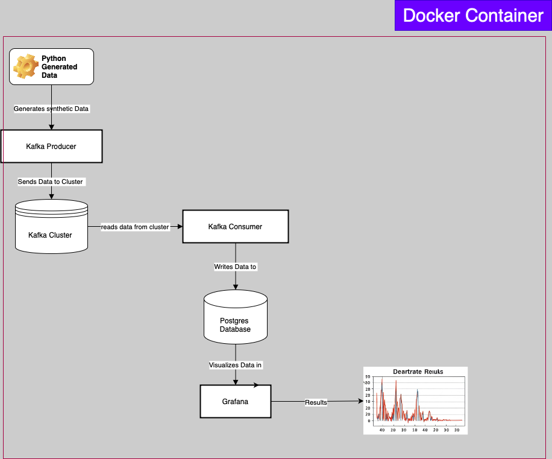

# Real-Time Customer Heart Beat Monitoring System

A real-time system for monitoring, processing, and visualizing customer heart rate data using kafka.

## Overview

This system provides a solution for collecting, processing, and analyzing generated synthetic heart rate data in real-time. It is  built using a kafka  with Docker containers for easy deployment.

## System Architecture



The system consists of the following components:

- **Data Generator**: Simulates heart rate data for multiple customers using python 
- **Kafka**: Message broker for real-time data streaming
- **PostgreSQL**: Database for persistent storage generated heart rate records
- **Dashboard**:  visualization of heart rate data and statistics

## Features

- **Real-time data generation**: Simulates heart rate data for multiple customers.
- **Data streaming**: Uses Apache Kafka for reliable message delivery and scalable data processing
- **Persistent storage**: Stores validated heart rate records in PostgreSQL
- **Real-time visualization**: Grafana Provides a web-based dashboard for monitoring heart rate data


## Prerequisites

- Docker and Docker Compose installed 
- Git (optional, for cloning the repository)

## Installation and Setup

1. Clone the repository or download the source code:
   ```bash
   git clone <repository-url>
   cd heart-beat-monitoring-system
   ```

2. Start the system using Docker Compose:
   ```bash
   docker-compose up -d
   ```

3. Verify that all services are running:
   ```bash
   docker-compose ps
   ```

## Accessing the Dashboard

The heart rate monitoring dashboard is available at:
```
http://localhost:3030
```

## Component Details

### Data Generator

- Generates synthetic heart rate data for multiple customers
- Produces data points with customer ID, timestamp, and heart rate
- Creates occasional outliers for testing alert functionality
- Sends data to Kafka topic for consumption by the processor

### Kafka Message Broker

- Provides reliable, scalable message delivery
- Ensures data is available for processing even if downstream services fail
- Configured with proper partitioning for load balancing

### PostgreSQL Database

Schema:
```sql
CREATE TABLE IF NOT EXISTS heartrate_data (
    customer_id varchar(25) PRIMARY KEY,
    heart_rate  INT,
    time TIMESTAMP
);

```

Includes appropriate indexes for optimized querying.

### Dashboard

- Built with Grafana for  visualization
- Shows real-time statistics as data feeds into postgres database
- Displays heart rate over time and distribution
- Provides real-time statistics (total readings, average, min, max)


## Monitoring and Logs

To view logs for a specific service:

```bash
docker-compose logs -f kafka_consumer
docker-compose logs -f kafka_producer
```

## Troubleshooting

Common issues and solutions:

1. **Services fail to start**:
   - Check logs: `docker-compose logs <service-name>`
   - Ensure required ports are available (3000 for dashboard, 9092 for Kafka, 5435 for PostgreSQL)
   - Verify Docker has sufficient resources

2. **No data appearing in dashboard**:
   - Check if data-generator is running: `docker-compose ps data_generator`
   - Verify Kafka topics: `docker exec -it kafka kafka-topics --bootstrap-server kafka:9092 --list`

3. **Database connection issues**:
   - Verify PostgreSQL is running: `docker-compose ps postgres`
   - Check database initialization: `docker exec -it postgres psql -U postgres -d heartbeat_db -c "SELECT COUNT(*) FROM heartbeats;"`

## Stopping the System

To stop all services:

```bash
docker-compose down
```

To stop all services and remove volumes (will delete all data):

```bash
docker-compose down -v
```

